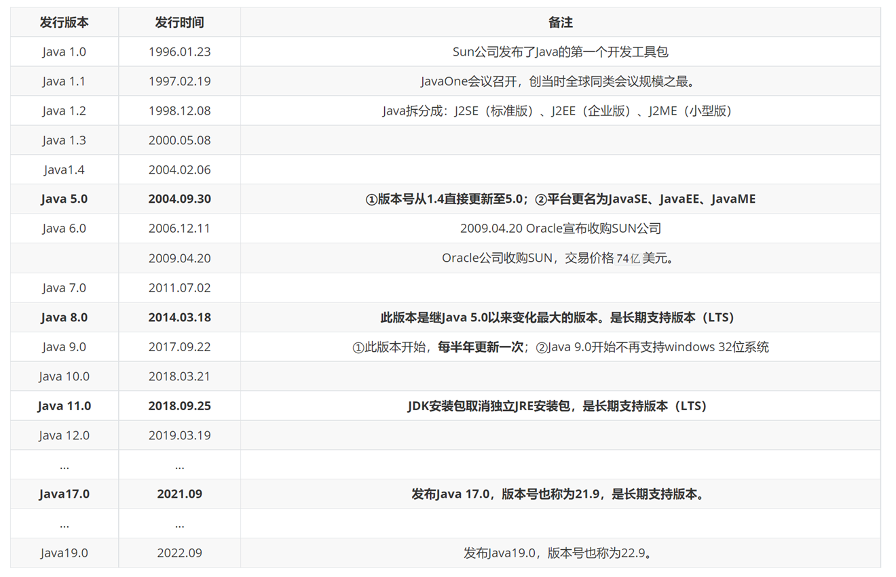
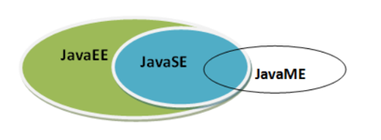
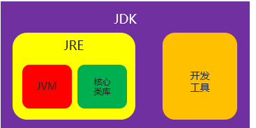
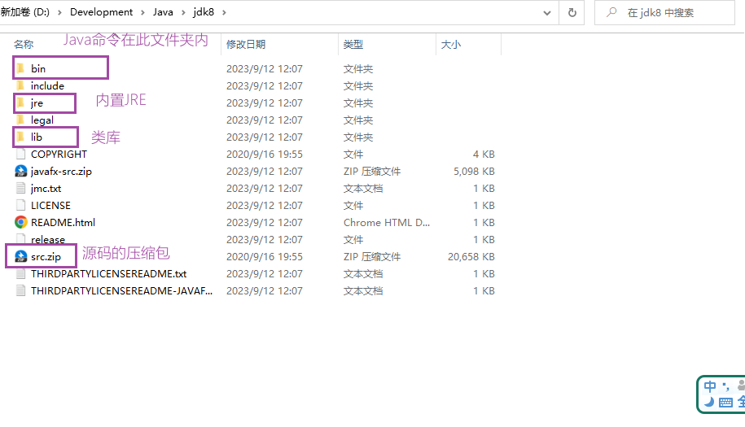
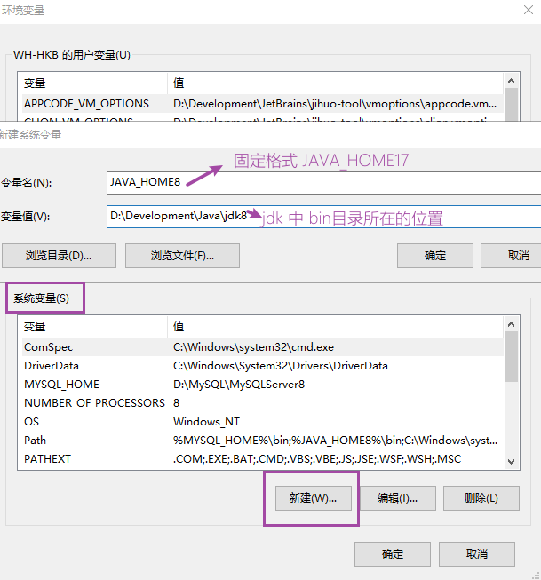
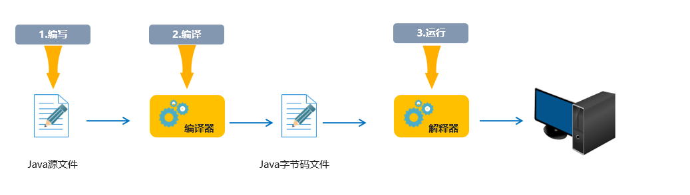

# Day_01随堂笔记

## 计算机常识

## 常见的DOS命令

> 如何打开DOS命令窗口 : win + r  输入CMD [大小写无所谓]

```java
ipconfig : 查看当前电脑网络连接情况 [Linux / MacOS : ifconfig ]
    
ping ip地址 : 检测此电脑的网络连接情况    //ping 网关[交换机 ip 为1的主机]
    
----------------------------------------------
查看文件夹/盘符的目录 :  dir
进入文件夹 : cd 文件夹名称 [cd 文件夹名称1\文件夹名称2\..... : 进入多级文件夹]   
退出文件夹 : cd.. [退一级] , cd\ [退到盘符的根目录]    
切换盘符 : 盘符名称:
清屏 : cls
退出 : exit     
```

## 计算机中的单元

```java
计算机中最小的存储单元 : 字节 byte B [计算机硬盘中一切皆字节]
计算机中最小的信息单元 : 比特[二进制码] bit b 位
    
换算单位 :
	1 B = 8 b; // 一个字节有8位;

字节自己的换算单位 :
	1 KB = 1024 B; 
	1 MB[兆] = 1024 KB;
	1 GB = 1024 MB;
	1 TB = 1024 GB;
	1 PB = 1024 TB;
	....
```

## Java语言发展史

```java
Java 语言 之前隶属SUN [斯坦福大学网络公司] , 现在由 Oracle [甲骨文]公司运营 ;

Java 语言诞生于 1995 年 , 1996年发布的第一个语言版本 [Java1.0]; 

Java语言平台 :
JavaSE : 桌面级开发和Java的基础语法
JavaEE : 企业级开发 [后台开发 / Web开发] //我们未来的就业方向
JavaME : 嵌入式开发 [后续被 Android 语言取代了]   
    
系统平台 :
	1. Windows
    2. MacOS
    3. Linux    
    
Java 语言子父 : 詹姆斯.高斯林    
    
Java 语言的优势 : 
	1. 一次编写到处[系统平台]运行  
    2. 免费 
    3. 开源[开放源代码]    
```





## JDK,JRE,JVM

```java
JDK[Java Development Kit] : Java开发工具包 
    1. 提供了Java原生的开发工具 
    2. 包含了JRE //装了JDK就可以不装JRE了
    
JRE[Java Runtime Environment] : Java运行环境    
    1. Java运行环境  
    2. 包含JVM
    
JVM[] : Java虚拟机
    1. Java程序运行的载体
    
开发Java程序比作农民伯伯种菜 :
	1. 菜需要种在地里 [地 : 载体]
    2. 菜能生长必须有适宜的环境 [适宜的环境 : JRE] //如果只是运行Java程序,安装JRE就够了   
    3. 菜想要丰收必须有化肥,除草,驱虫 ... [化肥,除草,驱虫 : JDK] //如果要开发Java程序,必须安装JDK    
```


> JVM 和 JRE 和 JDK 之间存在 包含关系 : JDK 包含 JRE , JRE 包含 JVM



## JDK的安装和卸载

> 注意事项 :
>
> 1. JDK17 跟换路径后,无脑下一步
> 2. JDK8 需要取消公共JRE的安装 [步骤如下]


## JDK的目录



## 配置path环境变量

```java
为什么配置path环境变量 : 
	能让jdk中bin目录下的命令在windows系统中的任意路径下执行;

如何配置path环境变量 //忘了去百度 [1. 高版本的jdk安装时会自动配  2. 网络中解决方案看下发布日期 , 新版jdk都不需要配置classpath]
```




## 第一封代码 HelloWorld

> 准备工作 :
>
> 1. 展示系统中文件后缀名 
> 2. 输入法设置 : 中文状态下使用英文标点

### Java代码如何运行的

```java
三步走 :
1. 编写代码 
2. 编译代码 : 把.java文件中的内容进行翻译[二进制语言],生成.class文件[如果编译失败就不生成]
3. 运行代码 : 当编译成功,可以运行代码     
```




### 编写阶段的步骤

```java
1. 新建文本文档,把后缀改成 .java  [文件名 : 写当前程序的名称]

2. 双击打开文件  [推荐使用 记事本软件 打开]   
    
3. 在文件中编写 Java 代码
    a. 编写类 [class]  //类 : 种类,类型 -> 一类事物  [Java程序最小的执行单元]
    	public class 类名{ //类名必须和文件名一致[一模一样]
            b. 编写主方法 //main : 程序的入口 
            public static void main(String[] args){
                c. 写程序逻辑 //在控制台输出一些内容 
                System.out.println("任意内容");    
            }    
        }

//编写完代码后 : 编译代码 [javac 文件名.java] 和 运行代码 [java 文件名]

注意事项 :
	1. 设置文件的编码格式是 GBK [ANSI : 本地字符集]
    2. 注意英文大小写
    3. 注意标点符号是英文的    
        
        
在一个Java文件中,可以定义多个类,但是有且仅有一个类能被public修饰,且这个类的类名必须和java文件名一致!        
```

## 关于换行

```java
1 ->  场景1 : println
    public class Demo1{
        public static void main(String[] args){
            System.out.println("Hello");
            System.out.println("World");
        }
    }

2 -> 场景2 : System.out.println();
	public class Demo1{
        public static void main(String[] args){
            System.out.print("Hello");
            System.out.println();
            System.out.println("World");
        }
    }

3 -> 场景3 : "\r\n" -> 换行符
	public class Demo1{
	public static void main(String[] args){
		System.out.print("Hello\r\n");
		
		System.out.println("World");
	}
}
```

## Nodepad++软件


## 注释 Comments

```java
注释 : 对代码的文字解释说明 
    作用 :
		1. 对代码进行解释
        2. 提示代码编写思路 [先写注释再写代码]  
            
    特点 : 
		注释不会被执行
            
    格式 :
		1. 单行注释 : //这一行内容都变成单行注释内容
        2. 多行注释 : 
				/*
					这里	
					都是
					多行
					注释
				*/
        3. 文档注释,文本注释 : //本质是多行注释,但是文档注释可以用于后期自动生成API[对源码进行解释说明的文档]文档
            	/**
            		这里	
					都是
					文档
					注释
            	*/
```

## IDE

```java
IDE : 具备开发功能的软件统称IDE 
    
现阶段接触到的IDE : 记事本 , Nodepad++ , IDEA , Eclipse , MyEclipse ....
    
    
Eclipse/MyEclipse : 早期[2015年之前]Java开发工具    //免费,简约
IDEA : 现在最常用的Java开发工具   //界面炫酷,功能强大 -> 收费
```

## IDEA的卸载


## IDEA的安装

