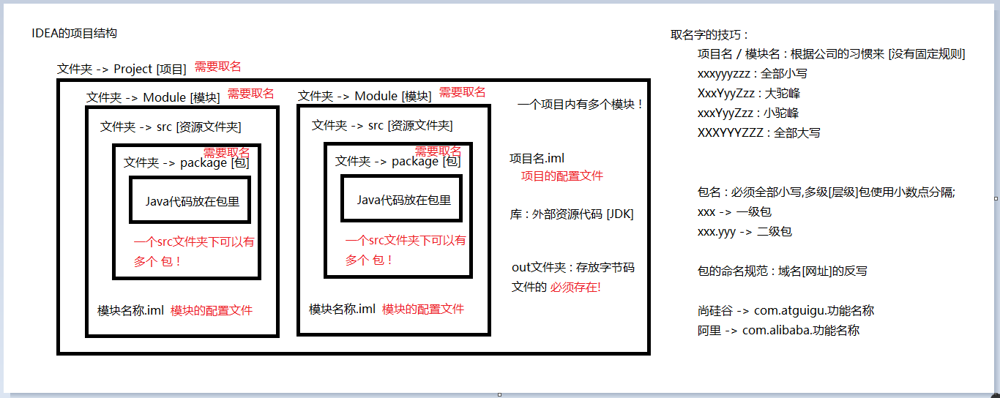
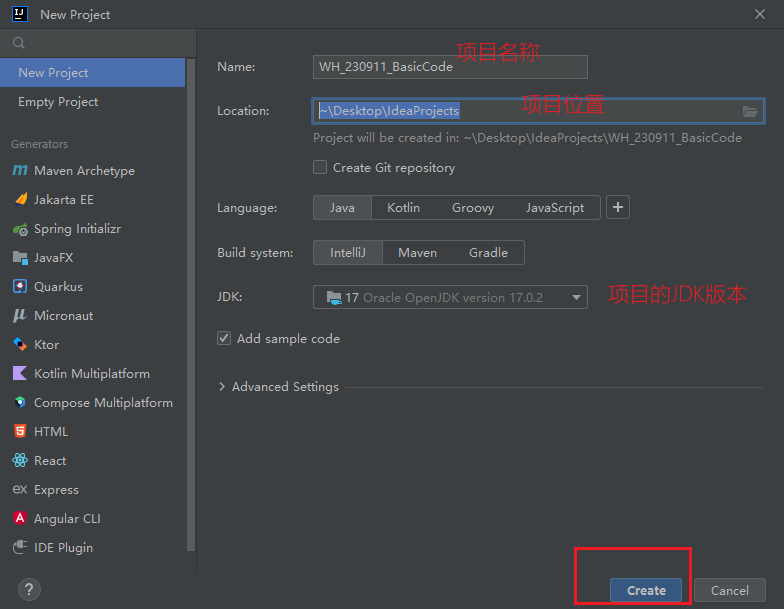
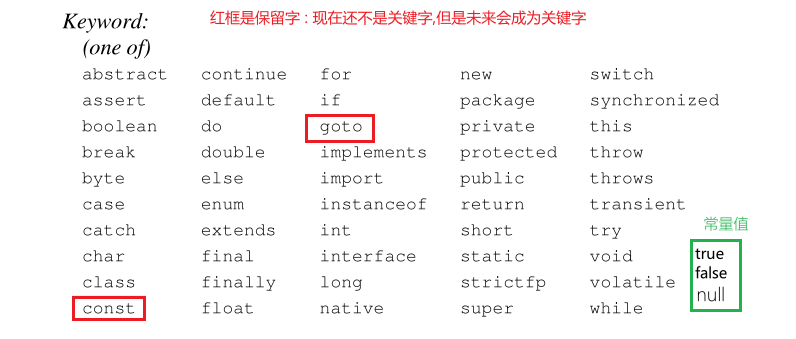
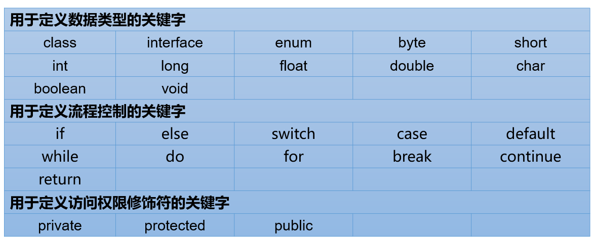
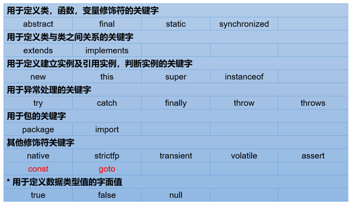
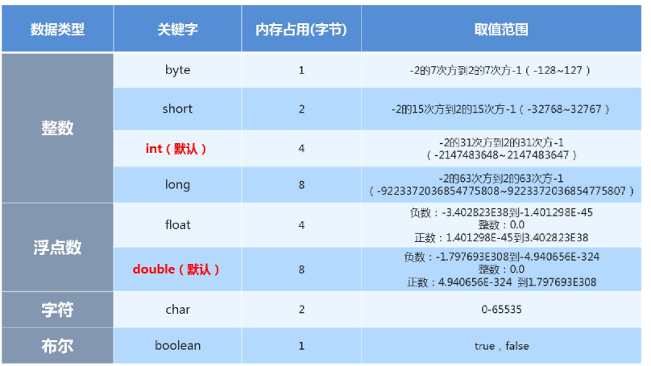

# Day_02随堂笔记

## IDEA的使用

### IDEA的项目结构 [重点]



### 项目的创建



### IDEA的快捷键

```java
    IDEA的常用快捷键 :
        ctrl 系列 :
            1. ctrl c/v/x : 复制/粘贴/剪切
            2. ctrl a : 全选
            3. ctrl z : 撤回
            4. ctrl d : 复制一行
            5. ctrl y : 删除当前行

        快捷代码 :
            主方法 : psvm / main
            输出语句 : sout
            自动补全 : .var

        注释快捷键 :
            单行注释 : ctrl + /  [取消再按一次]
            多行注释 : ctrl + shift + /    [取消再按一次]

        缩进快捷键 :
            tab : 向后
            shift + tab : 向前

        纠错快捷键 :  alt + 回车

    IDEA只要能提示一定提示,不提示一定是错了!  [提示严格区分大小写]

    IDEA 有预编译效果 [如果代码中有红杠,不要执行] 一个项目中只要有代码有红杠,其他代码都执行不了

    红杠 : 必须解决
    黄杠 : 警告,最好留意
    绿杠 : 命名的单词拼写错误

    格式化代码快捷键 : [美化代码]  ctrl + alt + l

    提示快捷键 : alt + / [源自eclipse] -> 需要设置
        
    移动代码的快捷键 : alt + shift + 上下键 [想去哪就去哪]/ ctrl + shift + 上下键 [只能在有效范围内移动]    
```

## 关键字

```java
关键字 : 被Java赋予特殊含义的单词 [交通标识 : 被交管部门赋予特殊含义的符号]
    例如 : class [类] , public [公共的] , static [静态的] , void [无返回值]
        
    特点 :
		1. 组成关键字的单词全部是小写单词 [String : 不是关键字]
        2. 每个关键字都有其特殊的含义,所以不能作为取名字的符号 
        3. 关键字在高级的IDE中有特殊颜色的表示 [蓝色]    
```







## 标识符

```java
标识符 : 用来取名字的符号  [项目名,模块名,包名,类名,变量名,方法名...]
    
标识符的组成 : //有且仅有 
	1. 英文字母大小写
    2. 数字
    3. 下划线 _
    4. 美元符号 $
    5. 汉字    
        
注意事项 :
	1. 关键字不能作为取名字的符号 
    2. 数字不能开头
    3. 最好不用下划线,美元符号,汉字
        下划线 : 自定义常量的命名 -> JAVA_HOME 
        美元符号 : 内部类类名 -> Outer$Inner 
        汉字 : 兼容问题    
    4. 取名字一定要有命名规范
            
            
命名规范 : 见名知意 -> 看到代码中的一个名字,能够猜测这个东西是干嘛的,是什么;   
	1. 项目名和模块名 : 跟着公司的习惯走
    2. 包名 : 全部小写,多级包使用.分隔 -> 域名的反写
    3. 变量/方法 : 小驼峰命名 xxxYyyZzz
    4. 类名 : 大驼峰命名 XxxYyyZzz
    5. 自定义常量 : 全部大写,中间用下划线分隔 XXX_YYY_ZZZ    
```

## 常量

```java
常量 : 在程序的运行过程中,值不会发生改变的量 //常青树
	1. 字面值常量  
	2. 自定义常量 -> 面向对象     
    
字面值常量 :
	1. 整数常量 : 正整数 , 0 , 负整数
        
    2. 小数常量 [浮点数常量] : 正小数 , 0.0 , 负小数
        
    3. 字符常量 : 单引号引起的单个元素 
        a . 字母字符 : 'A' , 'a'
        b . 数字字符 : '1' , '9' -> 数字字符的取值范围是 : '0' --> '9'
        c . 符号字符 : '!' , '%' , ' '    
        d . 汉字字符 : '我' , '中' 
        e . 空字符 : '\u0000' //特例 : Unicode编码表示空字符 -> ''  
            
    4. 字符串常量 : 双引号引起来的内容 //只要是双引号引起来的内容都是字符串常量 -> String
         字符串的本质就是一堆字符 : "今天天气很凉爽!" -> 由8个字符组成
         "" : 空字符串  " " : 空格字符串
             
    5. 布尔常量 : 表示正确和错误的一种常量值 ==> true , false
             
    6. 空常量 : null  // null 代表的是什么都没有,一般描述的是对象无地址 -> 为对象服务的
        
  
常量的作用 : 
	1. 给变量赋值 
    2. 常量可以直接输出 [null 不能直接输出]    
```

## 变量

```java
变量 : 在程序的运行过程中,值可以在一定范围内发生改变的量 ;
	可以 -> 可以变也可以不变
    一定范围内 -> 变量的值变化的范围是有限的 //不能乱变    
        
   例子 :  鸡蛋的价格是1元/颗;   
		1元/颗 -> 常量值
        鸡蛋的价格 -> 变量值   
            
变量的定义格式 :
	数据类型 变量名 = 初始化值;

	格式解释 :
		数据类型 : 数据的类型 //数据类型决定了变量值变化的范围 
        变量名 : 使用变量就是在使用变量名
        = : 赋值符 -> 把等号右边的值赋值给等号左边    
        初始化值 : 变量最开始的值  
            //初始化值可以是常量也可以是变量 
            int age = 18; //把18赋值给int类型的变量age
			int num = age; //把age变量代表的值赋值给int类型的变量num
```

## 数据类型

```java
数据类型 : 数据的类型 //Java是一门强类型的编程语言 [强类型 : 数据类型的划分和使用非常的严格]
    基本数据类型 : 有限个,四类八种
    引用数据类型 : 无数个,但是分为五大类
		类[class] , 接口 [interface] , 数组 [Array] , 枚举 [enum] , 注解 [@interface]	
```

### 基本数据类型

|      名称      | 所占字节数 |  取值范围  |
| :------------: | :--------: | :--------: |
|    **整型**    |            |            |
|  byte [字节]   |     1      | [-128,127] |
| short[短整型]  |     2      |  +-3万多   |
|   int[整型]    |     4      |  +-21亿多  |
|  long[长整型]  |     8      |  比int多   |
|   **浮点型**   |            |            |
| float[单精度]  |     4      |  比long多  |
| double[双精度] |     8      | 比float多  |
|   **字符型**   |            |            |
|      char      |     2      | [0,65535]  |
|   **布尔型**   |            |            |
|    boolean     |     1      | true,false |

> 注意事项 :
>
> 1. 整数优先使用int类型表示,小数优先使用double类型表示;
> 2. 最大的数的类型 : double



## 变量使用的注意事项

```java
变量使用的注意事项 :
        1. 使用变量就是使用变量的变量名
        2. 变量的值的变化是在一定范围内发生改变 [数据类型的范围决定的]
        3. 整数默认使用int类型,浮点数默认使用double类型
        4. 如果要表示long类型的变量需要在数值的后方加 L [如果数值的范围没有超过int的范围,可以省略L]
        5. 如果要表示float类型的变量需要在数值的后方加 F
        6. 变量未赋值不能直接使用 [变量可以先定义后赋值]
        7. 变量只在其定义的大括号内有效 , 出了大括号就无效了 [作用域问题]
        8. 在同一个作用域下 不可用出现同名变量
        9. 一行可以定义多个变量,但是多个变量的数据类型必须是一致的!
            格式 : 
                数据类型 变量名1 = 初始化值1,变量名2 = 初始化值2 .....;
```

## 基本数据类型之间的类型转换问题

```java
类型转换 : 把A类型的数据转换成B类型的数据
    
凭什么基本数据类型之间能做类型转换 ?  基本数据类型之间有大小关系 [排除boolean]    
    
基本数据类型之间的大小关系 :
	double > float > long > int > char , short , byte 
        //char , short , byte 类型的变量在做运算时会自动变成int类型再参与运算
        
基本数据类型之间的类型转换问题 :
	1. 自动提升 : 大类型的变量来接收小类型的变量/值  [小 --> 大]
        	例如 : 
				long num = 100;  
				double num1 = num;

	2. 强制转换 : 小类型的变量来接收大类型的变量/值 [大 --> 小]
        	例如 :
				int num = 100; //4个字节
				byte b = num; //1个字节  --> 报错

		强转有格式 : 小类型 变量名 = (小类型)(大类型的变量/数值);
			   	byte b = (byte)(num);
				byte b1 = (byte)200;

	强转要谨慎使用,数据是什么类型就拿什么类型的变量接收,不要动不动强转 !! -> 强转会导致数据类型的精度缺失!
        
 快捷代码 : .castvar [带转换的自动接收]       
```

